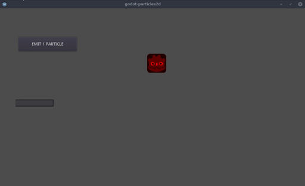

# godot-particle2d - particle 2d generator for Godot Engine

Module written for [Godot Engine](https://godotengine.org)

# Preview

# Usage

## Node + script

Copy and paste `main.gd` plus `main.tscn` to your game's directory and start using it.

## Script only

Copy and paste `main.gd` and attach it to a `Node2D` node.

# Limitations

Do not use more than **1024** particles on the same scene at the same time or it will impact performances significantly

# API

## Parameters

Parameters are similar to the embedded Particles2D node.

## Functions

Function name | Parameters | Description
------------ | -------------  | -------------
emit | `int amount` | Emits an amount of particles
set_particle_attractor | `NodePath node_path` | Set an attractor (useful for runtime update)

## Signals

Signal | Description
------------ | -------------
particle_expired | Emitted when a particle expires, only if `expire` is set to `true`
particle_attracted | Emitted when a particle is in the disable radius of the attractor

# Licensing

MIT (See license file for more informations)
